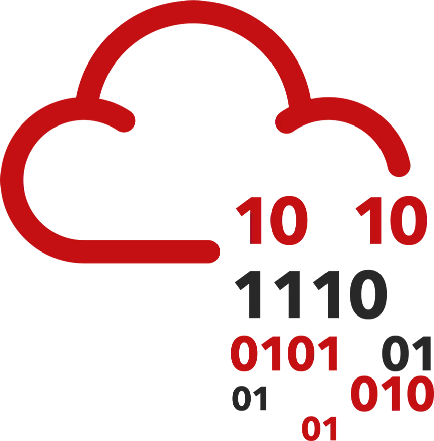
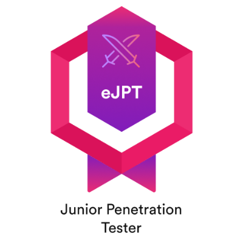

# Tauseef Ahmed • cyberHiker

**Hardening environments and tracking pathways — whether they run on silicon or soil.**

<a href="https://www.linkedin.com/in/tsfahmd01" target="_blank"> **LinkedIn**</a> &nbsp;&nbsp;&bull;&nbsp;&nbsp;
<a href="https://medium.com/@tsfahmd01" target="_blank"> **Medium**</a> &nbsp;&nbsp;&bull;&nbsp;&nbsp;
<a href="https://app.hackthebox.com/users/2147210" target="_blank"> **Hack The Box**</a> &nbsp;&nbsp;&bull;&nbsp;&nbsp;
<a href="https://tryhackme.com/p/tsfahmd01" target="_blank"> **TryHackMe**</a> &nbsp;&nbsp;&bull;&nbsp;&nbsp;
<a href="mailto:tsfahmd01@gmail.com"> **Email**</a>

I’m a cybersecurity professional and researcher focused on turning curiosity and controlled risk into stronger, more resilient environments. I operate across the full security spectrum, crafting offensive vectors, implementing defensive protections, researching AI-driven security paradigms and ensuring structural compliance. Having earned the **eJPT certification**, I actively participate in CTFs and research to polish my methodologies, audit systems and harden distributed architectures.

When I'm not in front of the terminal, I'm outdoors exploring trails and birdwatching with my buddies. I'm not just an average observer... ask me about **ecology, taxonomy and ferality**, and you'll see my eyes light up.

Be it system security or understanding natural ecological systems, I dive deep. This persistent drive keeps my **situational awareness sharp and my patience steady** — essential traits I bring into every assessment, research project and audit.

---

## Certifications

&nbsp;&nbsp;&nbsp;&nbsp;

---

## Stack

### ⚔️ Offensive & Exploitation
 &nbsp;&nbsp;&nbsp;&nbsp;
 &nbsp;&nbsp;&nbsp;&nbsp;
 &nbsp;&nbsp;&nbsp;&nbsp;

### 🛡️ Threat Analysis & Defense
 &nbsp;&nbsp;&nbsp;&nbsp;

### 💻 Languages & Agentic AI
 &nbsp;&nbsp;&nbsp;&nbsp;
 &nbsp;&nbsp;&nbsp;&nbsp;
 &nbsp;&nbsp;&nbsp;&nbsp;

### 📋 Frameworks & Standards
 &nbsp;&nbsp;&nbsp;&nbsp;
 &nbsp;&nbsp;&nbsp;&nbsp;
 &nbsp;&nbsp;&nbsp;&nbsp;

### 🖥️ Systems & Platforms
 &nbsp;&nbsp;&nbsp;&nbsp;
 &nbsp;&nbsp;&nbsp;&nbsp;
 &nbsp;&nbsp;&nbsp;&nbsp;

---

## Selected Work

### [LoMar](https://github.com/tsfahmd01/lomar)
A local defense framework against client compromises and data poisoning attacks in Federated Learning utilizing Kernel Density Estimation over CNN feature embeddings.

### [Patch2Pwn](https://github.com/tsfahmd01/Patch2Pwn)
An active research framework evaluating the capabilities of open-source Large Language Models in generating functional exploits for memory corruption vulnerabilities using security fixes and CVE metadata.

### [Book Recommender](https://github.com/tsfahmd01/book-recommender)
A machine learning recommendation engine utilizing content-filtering pipelines to deliver personalized book recommendations.

### [Sample Reports](https://github.com/tsfahmd01/sample_report)
Simulated professional vulnerability disclosure reports (DVAS-01 & VeCom-01) demonstrating threat categorization, CVSS v3.1 scoring, and mitigations.

---

## Blogs

- **[Enumeration as a Graph](https://medium.com/@tsfahmd01/enumeration-as-a-graph-how-a-different-recon-mindset-took-me-from-found-x-vuln-to-full-root-0a2ea2e21f89):** How a different recon mindset took me from “Found X Vuln” to full root compromise.
- **[When AI Model Learns Lies](https://medium.com/@tsfahmd01/when-ai-model-learns-lies-my-federated-learning-poisoning-experiment-7e7cbc05786e):** An experimental breakdown of Federated Learning poisoning.
- **[I Cleared eJPT](https://medium.com/@tsfahmd01/i-cleared-ejpt-my-first-offensive-security-certification-and-what-it-really-took-dc6d7873cf5c):** My first offensive security certification (and what it really took).
- **[My View on the THM Jr Pentester Road](https://medium.com/@tsfahmd01/my-view-on-the-jr-penetration-tester-learning-path-of-tryhackme-803a3b7afbe8):** A structured review of the TryHackMe learning path.

---

  "In nature, species adapt or go extinct. In security, systems adapt or get breached. Keep tracking, keep hardening."

